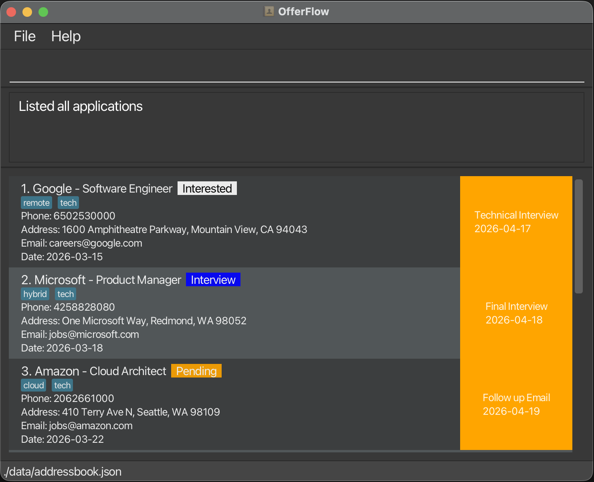
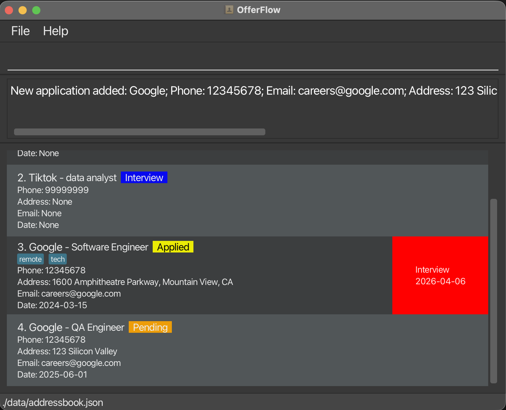
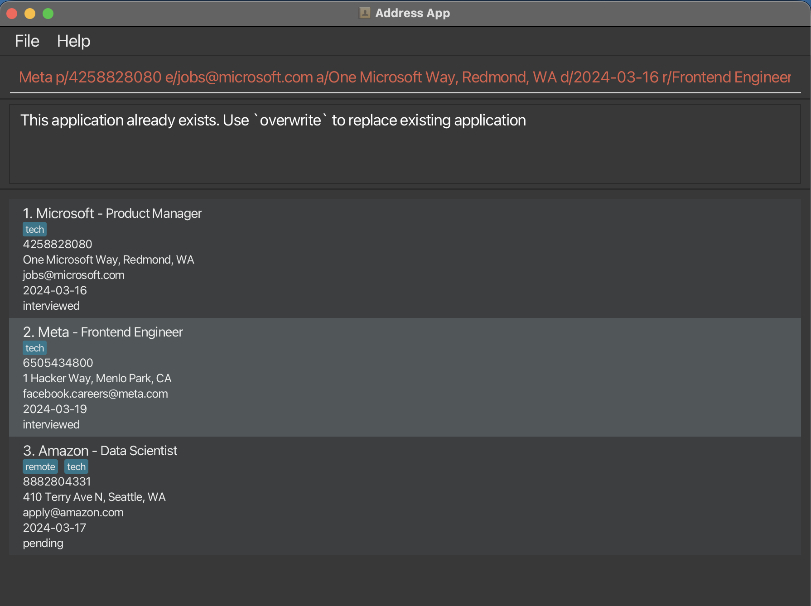
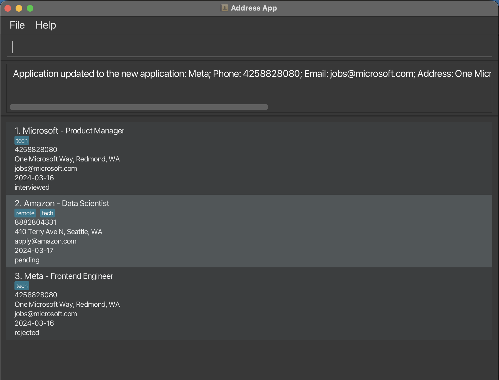
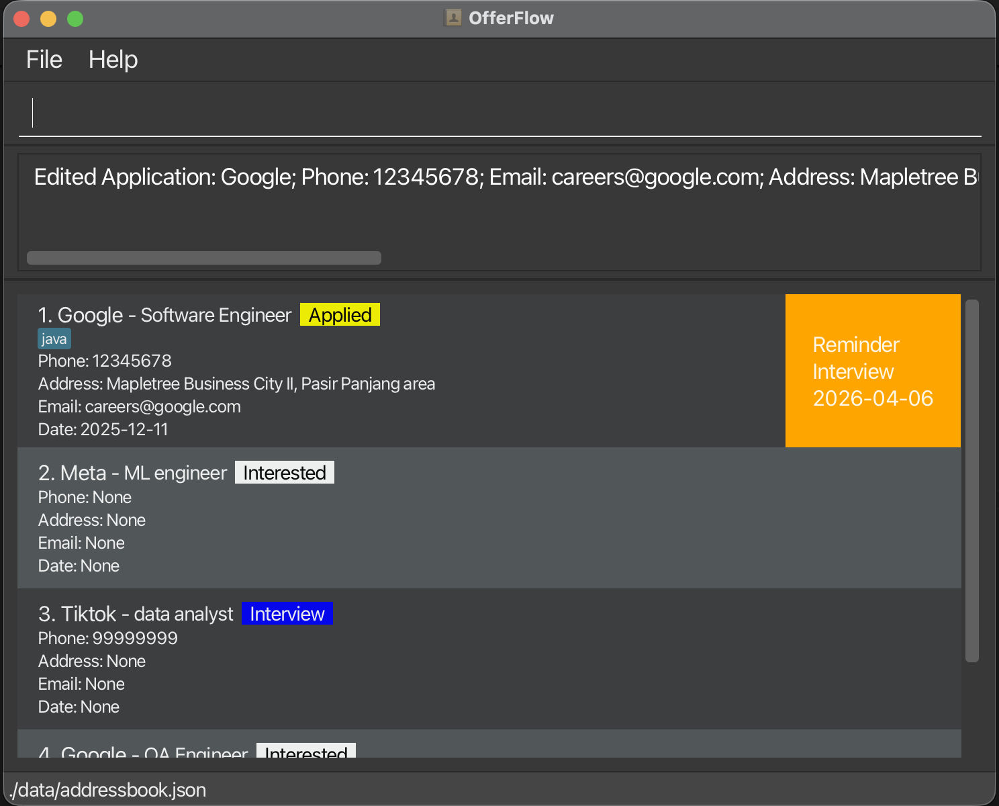
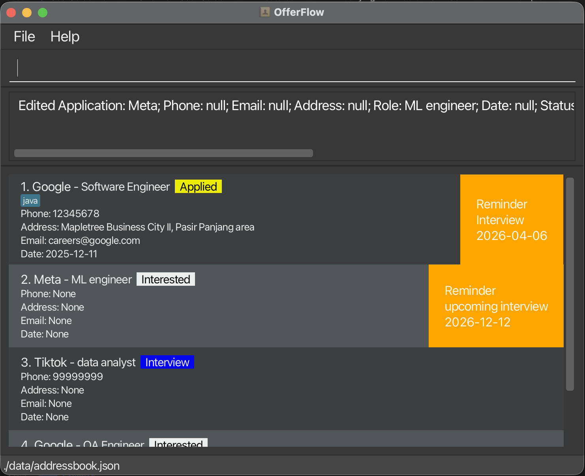
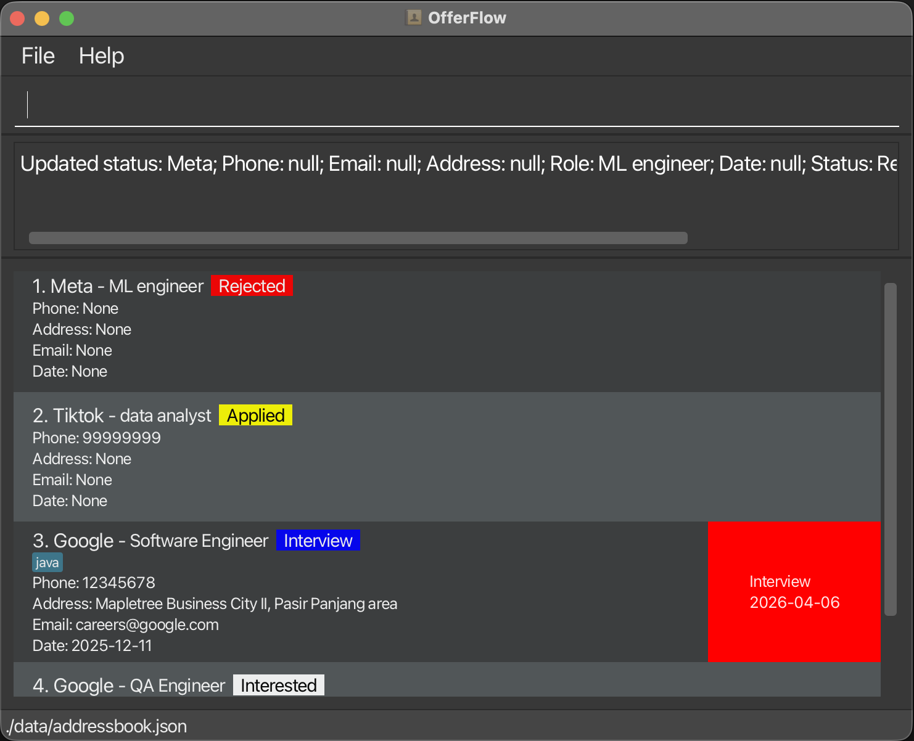
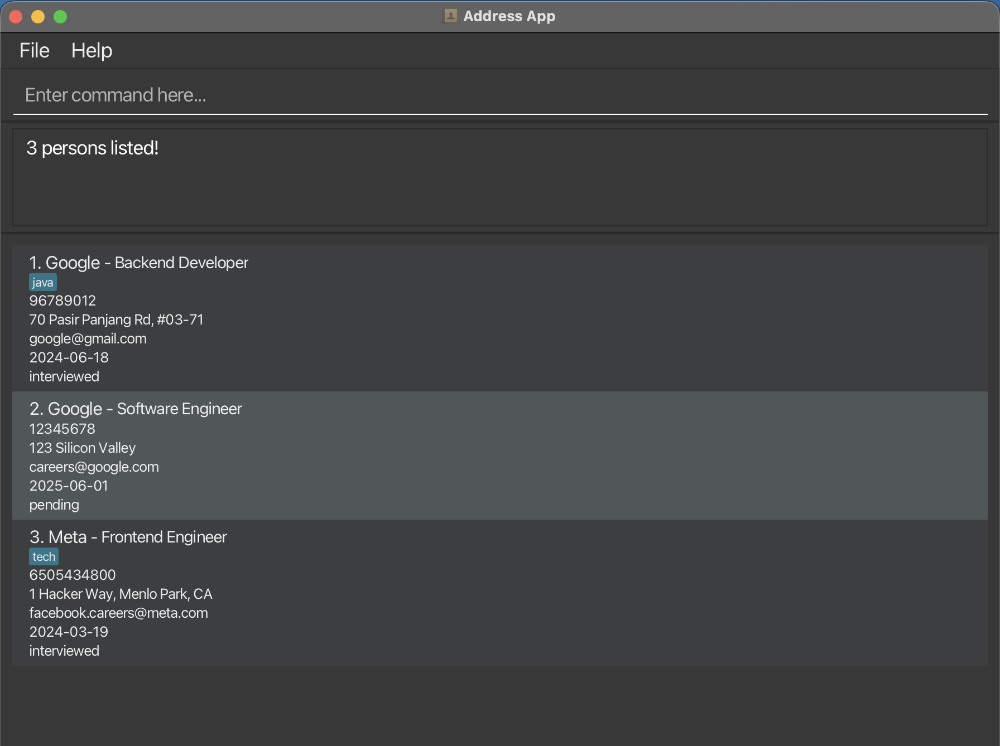
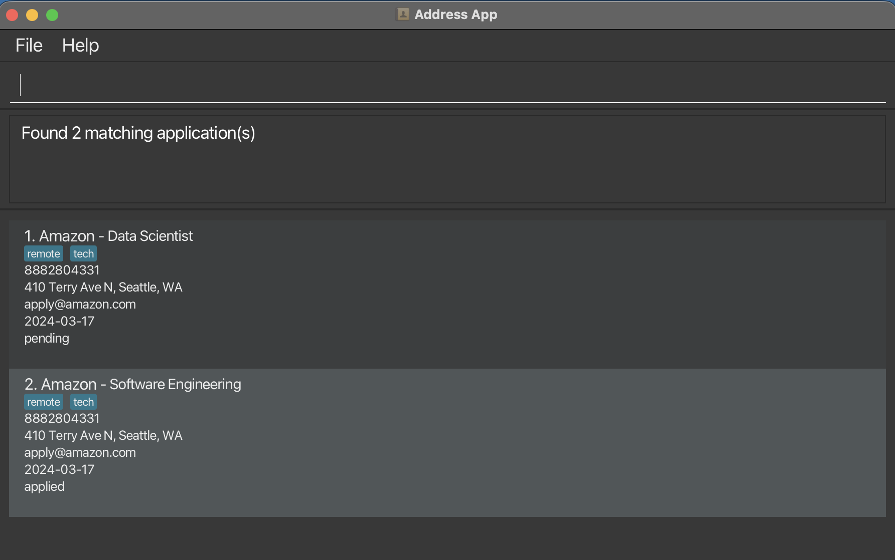
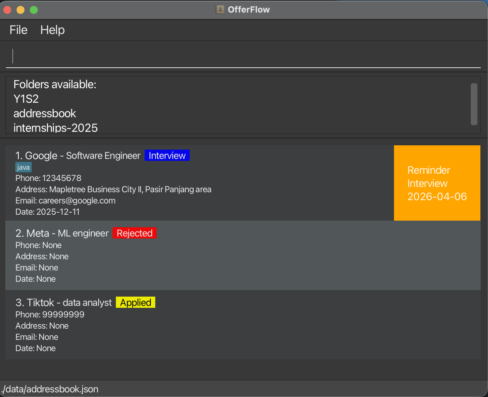

# OfferFlow User Guide

## 🎯 For the Internship-Hunting CS Student

Applying for internships is complex and time-consuming — balancing technical
interviews, projects, and academic commitments makes tracking applications overwhelming.

**OfferFlow** is designed to simplify this process. Built by CS students who understand
these challenges firsthand, OfferFlow is a desktop application that helps CS students:

- Track all internship applications in one place, replacing scattered spreadsheets and reminders
- Update and monitor application statuses quickly and easily
- Stay organised with minimal effort

OfferFlow is optimised for speed and efficiency, letting keyboard-focused users manage
their internship pipeline faster than traditional GUI-based tools.

<!-- * Table of Contents -->

<page-nav-print />

---

## Quick start

1. Ensure you have Java `17` or above installed in your Computer. 
   * **Mac users:** Ensure you have the precise JDK version prescribed [here](https://se-education.org/guides/tutorials/javaInstallationMac.html).
   * **Window users:** [Download](https://se-education.org/guides/tutorials/javaInstallationWindows.html) Java `17`
   * **Linux users:** [Download](https://se-education.org/guides/tutorials/javaInstallationLinux.html) Java `17`

2. Download the latest `.jar` file from [here](https://github.com/AY2526S2-CS2103T-F10-4/tp/releases).

3. Copy the file to the folder you want to use as the _home folder_ for your OfferFlow.

4. Open a command terminal, `cd` into the folder you put the jar file in, and use the `java -jar OfferFlow.jar` command to run the application. 
   The GUI always shows all applications with upcoming reminders due within the next 7 days at start-up. When you type `list` you will note that the app contains some sample data as shown below. 

   

5. Type the command in the command box and press Enter to execute it. e.g. typing **`help`** and pressing Enter will open the help window. 
   Some example commands you can try:
   * `list` : Lists all internship applications.
   * `add n/Google p/96789012 e/google@gmail.com a/70 Pasir Panjang Rd, #03-71 d/2024-06-18 r/Backend Developer s/interview t/java` : Adds your internship application to Offerflow.
   * `delete 3` : Deletes the 3rd contact shown in the current list.
   * `clear` : Deletes all applications.
   * `exit` : Exits the app.

6. Type the `clear` command to clear all the sample data and start adding your own applications that you wish to track!

7. Refer to the [Features](#features) below for details of each command.

---

## Features

<box type="info" seamless>

**Notes about the command format:** 

* Words in `UPPER_CASE` are the parameters to be supplied by the user. 
  e.g. in `add n/NAME`, `NAME` is a parameter which can be used as `add n/Google`.
* Items in square brackets are optional. 
  e.g `n/NAME r/ROLE [t/TAG]` can be used as `n/Google r/Software Engineer t/java` or as `n/Google r/Software Engineer`.
* Items with `…` after them can be used multiple times including zero times. 
  e.g. `[t/TAG]…` can be used as ` ` (i.e. 0 times), `t/java`, `t/java t/React` etc.
* Parameters can be in any order. 
  e.g. if the command specifies `n/NAME p/PHONE_NUMBER`, `p/PHONE_NUMBER n/NAME` is also acceptable.
* Extraneous parameters for commands that do not take in parameters (such as `help`, `list`, `exit`, `clear`, `folders`, `overwrite` and `editexit`) will be ignored. 
  e.g. if the command specifies `help 123`, it will be interpreted as `help`.
* If you are using a PDF version of this document, be careful when copying and pasting commands that span multiple lines as space characters surrounding line-breaks may be omitted when copied over to the application.
  </box>

### Application

An internship application must include a company name and the role applied for. All other fields are optional.
Each application supports the following parameters:

#### Parameters
- `n/NAME` → Name of the company
- `r/ROLE` → job position applied for
- `p/[PHONE]` → company telephone number
- `e/[EMAIL]` → company email
- `a/[ADDRESS]` → company location
- `d/[DATE]` → date when you applied
- `s/[STATUS]` → application progress
- `t/[TAGS]` → optional fields
- `u/[REMINDER] ud/[DATE]` → Reminder description and Date of reminder

### Adding an internship application: `add`

Adds the internship application you have applied for, to help track all your applications.

<box type="warning" seamless>

**Caution:**
OfferFlow by default does not allow duplicate application with same name and role. Hence, if you choose to add application with duplicate name and role, you can choose whether or not to overwrite it (ie: replace the pre-existing application with the new application)
</box>

Format: `add n/NAME r/ROLE ...`

<box type="tip" seamless>

**Tip:** 
* Application can be added with only the `n/NAME` and `r/ROLE` fields, other fields are optional
* Application parameters (except name and role) can be removed by leaving the value after the prefix empty

</box>

<box type="info" seamless>

**⚠️ Note:**
* name and role is case insensitive
* name does not allow some special character like /
* Emails should be of the format `local-part@domain`
* If applied dates (`d/DATE`) must use `YYYY-MM-DD` and cannot be a future date
* Reminder can only be added if both reminder name (`u/`) and reminder date (`ud/`) is provided
* Reminder due today or earlier will be displayed in red, others will be displayed in orange
* Multiple tags allowed
* Default status is `Interested`
* Blank parameters are stored as empty strings during the session; reloading the app resets them back to `None`.

</box>

#### Examples:
* `add n/Meta r/ML engineer`
* `add n/Tiktok r/data analyst p/99999999 s/interview`
* `add n/Google r/Software Engineer p/12345678 e/careers@google.com a/1600 Amphitheatre Parkway, Mountain View, CA d/2024-03-15 s/applied t/tech t/remote u/Interview ud/2026-04-06`
* `add n/Google p/12345678 e/careers@google.com a/123 Silicon Valley d/2025-06-01 r/QA Engineer s/pending`

#### Expected Outcome:

  

### Overwrite duplicate application : `overwrite`

Overwrites pre-existing application in OfferFlow that has the same name and role, with the new application when you try to add an application with the same name and role as another already existing application

#### Example:
* `add n/Google r/QA Engineer d/2025-12-12 s/ `

  

Format: `overwrite`

If you choose to overwrite, type `overwrite`. If not, continue using the app as per normal and the new duplication application you were trying to add will be **automatically discarded**

<box type="warning" seamless>

**Caution:** If you do not choose to `overwrite`, the duplication application gets automatically discarded and this action is irreversible

</box>

#### Expected Outcome (overwrite):

  

### Editing an application : `editmode`

Format:
1. `editmode INDEX` or `editmode n/NAME r/ROLE` to enter edit mode to edit that particular application
2. Type in any combination of at least one of the internship application parameters [above](#application) to edit the application
3. `editexit` to finish editing and exit the editing mode

<box type="info" seamless>

**⚠️ Note:**
* Enters editing mode for the application at the specified `INDEX` or with the specified `NAME` and `ROLE`. The index refers to the index number shown in the displayed application list. The index **must be a positive integer** 1, 2, 3, …
* Once editing mode is entered, *all commands* except for *editexit* and *editing commands* will be disabled.
* Edit the application in edit mode by typing in at least one of the optional fields.
* Existing values will be updated to the input values.
* When editing tags, the existing tags of the application will be removed i.e adding of tags is not cumulative.
* You can remove all the application’s tags by typing `t/` without
  specifying any tags after it.

</box>

<box type="tip" seamless>

**Tip:**
* you can remove and add tags add the same time by typing `t/` to remove the tag and `t/TAG` to specific any tag you want to add
* you can remove any optional fields by simply typing the prefix without any parameter (ie: typing `a/` removes the current address)

</box>

#### Examples:
* `editmode 1` or `editmode n/Google r/Software Engineer`
* `a/Mapletree Business City II, Pasir Panjang area t/java`
* `d/2025-12-11`
* `editexit`

#### Expected outcome:

  

### Modifying Reminders: `Reminder`

Use `editmode` command to modify or create new Reminders.

Format: `u/DESCRIPTION ud/DATE`

<box type="info" seamless>

**⚠️ Note:**
* both `u/DESCRIPTION ud/DATE` must be provided to modify/create reminders
* reminder allows past dates as well

</box>

#### Example:
* `editmode 2`
* `u/upcoming interview ud/2026-12-12`
* `editexit`

#### expected outcome:

  

* Creates a new upcoming interview Reminder on 12 December 2026.

Use `rmr` command **outside** of `editmode` to remove Reminder of specified Application.

Format: `rmr INDEX` or `rmr n/NAME r/ROLE`

<box type="info" seamless>

**⚠️ Note:**
* `INDEX`: Application index reflected on list.
* `n/NAME r/ROLE`: represents an Application to `NAME` for `ROLE`.

</box>

#### Example:
* `rmr 2` or `rmr n/Tiktok r/data analyst`

#### expected outcome:
* Removes the reminder for the application at index 2 or the application with the specified company name and job role.

### Updating application status: `status`

Updates the status of an **existing** application.

Format: `status n/COMPANY_NAME r/JOB_ROLE s/STATUS`

<box type="tip" seamless>

**Tip:** Status is case-insensitive (e.g. `applied`, `Applied`, `APPLIED` all work)

</box>

<box type="info" seamless>

**⚠️ Note:**
* Application with the name and role must exist in order to update status
* Status to change to must be a valid status (see below)
* Default status is `Interested` if no status provided
  (eg: `status n/google r/software engineer s/` changes the application status to `Interested`)

</box>

#### Valid Statuses
| Status         | When to use                                                                     |
|:---------------|:--------------------------------------------------------------------------------|
| **Interested** | Found the role, planning to apply                                               |
| **Applied**    | Submitted your application                                                      |
| **Interview**  | Interviews scheduled (congrats, halfway there!)                                 |
| **Pending**    | Waiting for Application outcome                                                 |
| **Rejected**   | Didn't get it (we've all been there)                                            |
| **Offered**    | 🎉 You got the offer!                                                           |
| **Accepted**   | You accepted the offer (your hardwork has paid off!)                            |

#### Examples

* `status n/Tiktok r/Data Analyst s/Applied`
* `status n/Google r/Software Engineer s/Interview`
* `status n/Meta r/ML Engineer s/Rejected`

#### Expected Outcome

  

<box type="warning" seamless>

**Caution:**
- Application with both **company name and role must be present**
- Command will fail if:
  - missing parameters
  - invalid format
  - application does not exist
</box>

### Locating applications by the company name: `find`

Helps you finds applications whose company names contain any of the given keywords.

Format: `find KEYWORD [MORE_KEYWORDS]`

<box type="info" seamless>

**⚠️ Note:**
* The search is case-insensitive. e.g `google` will match `Google`
* The order of the keywords does not matter. e.g. `Google Meta` will match `Meta Google`
* Only the company name is searched.
* Only full words will be matched e.g. `Goog` will not match `Google`
* Applications matching at least one keyword will be returned (i.e. `OR` search).
  e.g. `Google Meta` will return `Google`, `Meta`

</box>

#### Examples
* `find Meta` returns all applications applied to `Meta`
* `find Meta Google` returns all applications applied to `Meta` and `Google` 

#### Expected Outcome:

  

### Listing all internship applications : `list`

Format: `list`

#### Expected Outcome:
Shows a list of all the applications you have added into OfferFlow

### Locating applications with upcoming deadlines: `upcoming`

Helps you find applications with upcoming reminders. Moreover, OfferFlow automatically
filters for applications with reminders due within one week on start-up.

Format: `upcoming DAYS`

<box type="info" seamless>

**⚠️ Note:**
* Applications with no reminders at all will not be returned.
* Applications with reminders that are overdue (e.g due prior to the current date) will not be returned.
* `DAYS` is an integer from 0 to 7 inclusive

</box>

#### Examples
* `upcoming 0` returns all applications with reminders due within 0 days of today, ergo by today.
* `upcoming 7` returns all applications with reminders due within 7 days of today, ergo within a week.

#### Expected Outcome:
* Displays all the applications with reminders due within the specified number of DAYS

### Filtering applications: `filter`

Filters applications by company, applied date, role, status, and/or tag. Allows filtering of multiple fields.

Format:
* `filter n/NAME`
* `filter d/YYYY-MM-DD`
* `filter r/ROLE`
* `filter s/STATUS`
* `filter t/TAG`

<box type="info" seamless>

**⚠️ Note:**
* Filter matching is case-insensitive.
* Leading and trailing spaces are ignored.
* Internal spacing still matters.
* Applied dates must use `YYYY-MM-DD`.

</box>

Examples:
* `filter n/Google`
* `filter d/2025-11-11`
* `filter r/Software Engineer`
* `filter s/Applied t/java`

#### Expected Outcome (eg: filter n/Google)

  

### Deleting an application : `delete`

Delete an application in OfferFlow via index or reference via Company name and Role.

Format: `delete INDEX` or `delete n/NAME r/ROLE`

* Deletes the application at the specified `INDEX`.
* Deletes the specific ppplication with the `NAME` and `ROLE`

<box type="warning" seamless>

**Caution:**
* The index **must be a positive integer** 1, 2, 3, …​
</box>

#### Examples
* `delete 4` or `delete n/google r/QA engineer` deletes the application at index 4 on the list or
application for Google as QA engineer

#### Expected Outcome:
* Removes the specified application from the list

### Creating a new OfferFlow folder : `folder`

Creates a new empty OfferFlow folder saved under `data/FOLDER_NAME.json` and switches to it.

Format: `folder FOLDER_NAME`

<box type="info" seamless>

**⚠️ Note:**
* `FOLDER_NAME` can only contain letters, numbers, spaces, underscores (`_`), hyphens (`-`), dots (`.`), and `@` symbols

</box>

<box type="warning" seamless>

**Caution:**
- Folder name cannot be empty
- Folder name cannot contain special characters other than underscores (`_`), hyphens (`-`), dots (`.`), and `@` symbols
- Folder names are always saved in lowercase regardless of input (e.g. `folder Y1S2` saves as `data/y1s2.json`)
- If a folder with the same name already exists (case-insensitive), the command will fail. Use `toggle FOLDER_NAME` to switch to it instead.
</box>

#### Examples
* `folder Y1S2` creates and switches to the new OfferFlow folder at `data/y1s2.json`
* `folder internships-2025` creates and switches to `data/internships-2025.json`

#### Expected Outcome:
- A new empty OfferFlow folder is created and you are switched to it immediately.
- Folder names are always stored in lowercase (e.g. `folder Y1S2` creates `data/y1s2.json`).
- The status bar at the bottom of the window updates to show the current file path (e.g. `./data/y1s2.json`).

### Switching to an existing OfferFlow folder : `toggle`

<box type="info" seamless>

**⚠️ Note:**
* The default folder is called `addressbook`

</box>

Switches to an existing OfferFlow folder saved under `data/FOLDER_NAME.json`.

Format: `toggle FOLDER_NAME`

<box type="warning" seamless>

**Caution:**
- Folder name cannot be empty
- Folder name cannot contain special characters other than underscores (`_`), hyphens (`-`), dots (`.`), and `@` symbols
- The address book file must already exist at `data/FOLDER_NAME.json`
- Folder names are case-insensitive — `toggle Y1S2` and `toggle y1s2` switch to the same file `data/y1s2.json`
</box>

#### Examples
* `toggle addressbook` switches to the default starting folder at `data/addressbook.json`
* `toggle Y1S2` switches to the OfferFlow folder at `data/y1s2.json`
* `toggle internships-2025` switches to `data/internships-2025.json`

#### Expected Outcome:
- You are switched to the OfferFlow folder and its applications are loaded if any.
- The status bar at the bottom of the window updates to show the current file path (e.g. `./data/y1s2.json`).

### Listing all address books : `folders`

Lists all existing OfferFlow folders saved in the `data` directory.

Format: `folders`

#### Expected Outcome:
- All available OfferFlow folder names are displayed (one per line), sorted alphabetically.
- By default, the OfferFlow folder named `addressbook` always exists

  

### Clearing all entries : `clear`

<box type="warning" seamless>

**Caution:**
* ⚠️ Removes **ALL** applications. Use with caution.
</box>

You can delete all applications on OfferFlow with just 1 command hassle-free!

Format: `clear`

### Exiting the program : `exit`

Closes OfferFlow.

Format: `exit`

### Viewing help : `help`

Shows you a message explaining how to access the help page.

  

Format: `help`

### Saving the data

OfferFlow data are saved in the hard disk automatically after any command that changes the data. There is no need to save manually.

### Editing the data file

OfferFlow data are saved automatically as a JSON file depending on the folder the user is in, eg. `[JAR file location]/data/addressbook.json` or `[JAR file location]/data/Y1S1.json` etc. Advanced users are welcome to update data directly by editing these data files.

<box type="warning" seamless>

**Caution:**
If your changes to the data file makes its format invalid, OfferFlow will discard all data and start with an empty data file at the next run.  Hence, it is recommended to take a backup of the file before editing it. 
Furthermore, certain edits can cause OfferFlow to behave in unexpected ways (e.g., if a value entered is outside the acceptable range). Therefore, edit the data file only if you are confident that you can update it correctly.
</box>

---

## FAQ

**Q**: How do I transfer my data to another Computer? 
**A**: Install the app in the other computer and overwrite the empty data file it creates with the file that contains the data of your previous OfferFlow home folder.

---

## Known issues

1. **When using multiple screens**, if you move the application to a secondary screen, and later switch to using only the primary screen, the GUI will open off-screen. The remedy is to delete the `preferences.json` file created by the application before running the application again.
2. **If you minimize the Help Window** and then run the `help` command (or use the `Help` menu, or the keyboard shortcut `F1`) again, the original Help Window will remain minimized, and no new Help Window will appear. The remedy is to manually restore the minimized Help Window.

--------------------------------------------------------------------------------------------------------------------

## Command summary

| Action              | Format                                                                                             | Example                                                                                                                          |
|:--------------------|:---------------------------------------------------------------------------------------------------|:---------------------------------------------------------------------------------------------------------------------------------|
| **Add**             | `add n/NAME r/ROLE p/[PHONE] e/[EMAIL] a/[ADDRESS] d/[DATE] s/[STATUS] t/[TAG...] u/[REMINDER] ud/[DATE]`                           | `add n/Google r/Backend Developer p/96789012 e/google@gmail.com a/70 Pasir Panjang Rd, #03-71 d/2024-06-18 s/interview t/java` |
| **Overwrite**       | `overwrite`                                                                                        | `overwrite`                                                                                                                      |
| **Delete**          | `delete INDEX` or `delete n/NAME r/ROLE`                                                           | `delete 3` or `delete n/Google r/Backend Developer`                                                                              |
| **Enter Edit**      | `editmode INDEX` or `editmode n/NAME r/ROLE`                                                       | `editmode 1` or `editmode n/Nus r/System Engineer`                                                                               |
| **Edit**            | While in editmode: `a/ADDRESS` or `s/STATUS` or ...                                                   | `a/Mapletree Business City II, Pasir Panjang area` or `s/applied`                                                                |
| **Exit Edit**       | `editexit`                                                                                         | `editexit`                                                                                                                       |
| **Remove Reminder** | `rmr INDEX` or `rmr n/NAME r/ROLE`                                                                 | `rmr 3` or `rmr n/Google r/Backend Developer`                                                                                    |
| **Status**          | `status n/COMPANY r/ROLE s/STATUS`                                                                 | `status n/Tiktok r/Data Analyst s/Rejected`                                                                                      |
| **Find**            | `find KEYWORD [MORE_KEYWORDS]`                                                                     | `find James Jake`                                                                                                                |
| **Filter**          | `filter n/NAME` or `filter r/ROLE` or `filter d/YYYY-MM-DD` or `filter s/STATUS` or `filter t/TAG` | `filter n/Tiktok` or `filter r/Software Engineer` or `filter d/2024-06-18` or `filter s/Rejected t/java`                         |
| **Folder**          | `folder FOLDER_NAME`                                                                               | `folder Y1S2`                                                                                                                    |
| **Toggle**          | `toggle FOLDER_NAME`                                                                               | `toggle Y1S2`                                                                                                                    |
| **List Folders**    | `folders`                                                                                          | `folders`                                                                                                                        |
| **List**            | `list`                                                                                             | `list`                                                                                                                           |
| **Clear**           | `clear`                                                                                            | `clear`                                                                                                                          |
| **Help**            | `help`                                                                                             | `help`                                                                                                                           |
